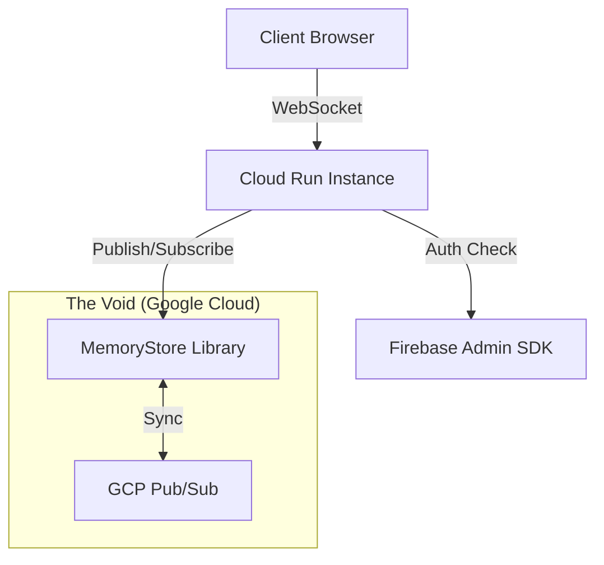

# 👻 GhostMe

> **Speak to the void. It listens.**

**GhostMe** is a distributed, ephemeral, authenticated chat platform disguised as a paranormal terminal. It combines a "Cyber-Occult" aesthetic with a robust, cloud-native architecture capable of scaling across multiple server instances.


## 🔮 The Manifestation (Features)

* **Ephemeral Messaging:** Messages haunt the screen for 60 seconds before fading into the void and deleting themselves from the DOM.
* **Distributed Seance:** Uses **[MemoryStore](https://github.com/BryceWayne/MemoryStore)** to sync messages across multiple Google Cloud Run instances via GCP Pub/Sub.
* **Anonymous Identity:** Users appear as "Anonymous" ghosts in the UI, but are cryptographically verified via **Firebase Auth** (Gmail only) for internal audit logging.
* **Cyber-Occult UI:** Custom CRT scanline effects, neon-void aesthetics, and glitch typography using TailwindCSS.
* **Secure Transport:** Session management via secure, HTTP-Only cookies.

## 🏗️ Summoning Architecture

GhostMe isn't just a WebSocket wrapper. It implements a fully distributed Pub/Sub architecture to ensure that a ghost on Server A can speak to a ghost on Server B.



### Core Technology

* **Backend:** Go (Fiber v2)
* **Frontend:** HTMX (WebSockets), TailwindCSS, Vanilla JS
* **State & Pub/Sub:** [BryceWayne/MemoryStore](https://github.com/BryceWayne/MemoryStore)
* **Auth:** Firebase Authentication (Google Provider)

## 🕯️ Incantations (Local Development)

### Prerequisites

1. **Go 1.24+** installed.
2. A **Firebase Project** with Google Auth enabled.
3. A **Google Cloud Project** with Pub/Sub API enabled.

### 1. Configuration

Create the client-side config file:
`public/js/config.js`

```javascript
export const firebaseConfig = {
    apiKey: "YOUR_API_KEY",
    authDomain: "your-project.firebaseapp.com",
    projectId: "your-project",
    // ... rest of your firebase config
};

```

Download your Firebase Admin private key and save it in the root as:
`serviceAccountKey.json`
*(Note: This file is ignored by git for security)*

### 2. Run the Server

```bash
go mod download
go run ./cmd/server
```

Open your browser to `http://localhost:8080`.

## ⚰️ Exorcism (Deployment)

GhostMe is designed for **Google Cloud Run**. It automatically detects the environment and switches from local memory to Google Cloud Pub/Sub.

### 1. Docker Build

The project uses a multi-stage `Dockerfile` based on Alpine Linux. It forces MIME type registration to ensure proper loading of ES6 modules.

### 2. Deploy to the Cloud

```bash
gcloud run deploy ghost-chat \
    --source . \
    --region us-central1 \
    --allow-unauthenticated
```

### 3. Final Binding

Once deployed, you must add your Cloud Run URL (e.g., `https://ghost-chat-xyz.run.app`) to the **Authorized Domains** list in the Firebase Console, or the login popup will fail.

## 📜 License

This project is licensed under the MIT License - see the LICENSE file for details.

---

*Built with 💀 by [BryceWayne*](https://github.com/BryceWayne)